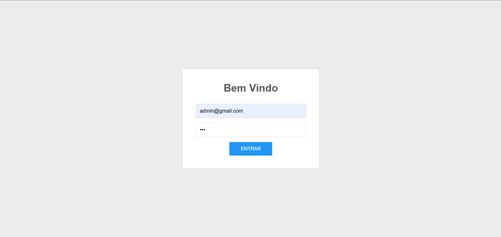
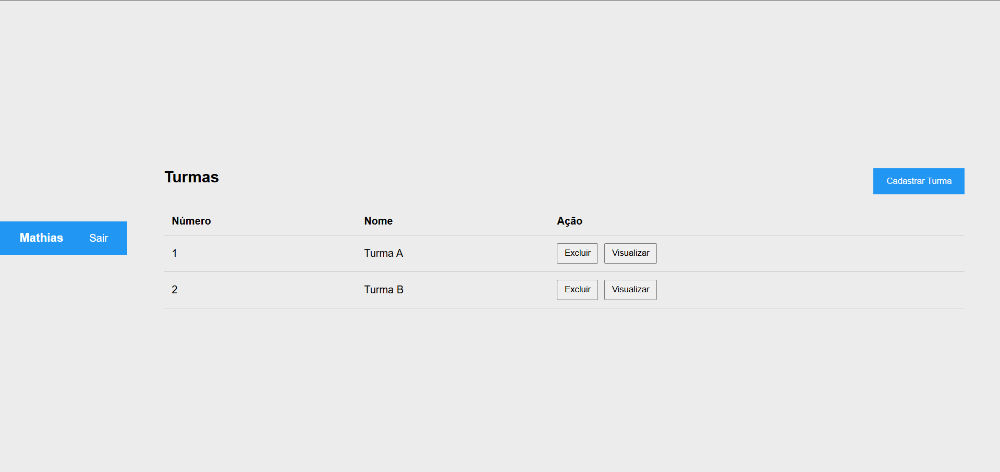
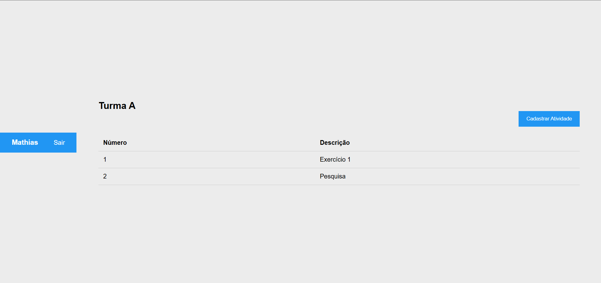
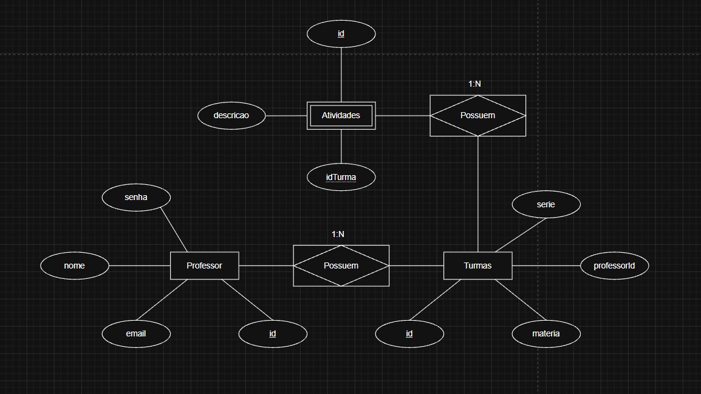

# Escola Avaliação

## Descrição do projeto

Projeto Full Stack para gerenciamento de turmas e atividades de professores.

---

## Tecnologias

### Backend:
- Node.js
- Express
- Prisma 
- MySQL

### Frontend:
- HTML
- CSS
- JavaScript

### Ferramentas:
- VS Code
- Insomnia
- SQL
- GitHub

---

## Funcionalidades

- Login de professores
- Cadastro de turmas
- Listagem de turmas
- Exclusão de turmas
- Visualização de atividades da turma
- Cadastro de atividades
- Listagem de atividades
- Logout do sistema

---

## Como executar

### Banco de Dados

Criar um banco de dados chamado:

```sql
CREATE DATABASE educ;
```

Configurar o arquivo `.env`:

```env
PORT=3000
DATABASE_URL="mysql://root@localhost:3306/educ"
```

Executar as migrations:

```bash
npx prisma migrate dev
```

---

### Backend

Entrar na pasta:

```bash
cd api
```

Instalar dependências:

```bash
npm install
```

Executar o servidor:

```bash
node server.js
```

Servidor disponível em:

```txt
http://localhost:3000
```

---

### Frontend

Abrir a pasta `web` utilizando a extensão Live Server do VS Code.

Exemplo:

```txt
http://127.0.0.1:5500/login.html
```

---

## Usuário para testes

Email:

```txt
admin@gmail.com
```

Senha:

```txt
123
```

---

## Linguagens Utilizadas

- JavaScript
- HTML
- CSS
- SQL

---

## Prints do Sistema

### Tela de Login



---

### Tela Principal do Professor



---

### Tela de Atividades



---

## Diagrama Entidade Relacionamento (DER)



---
